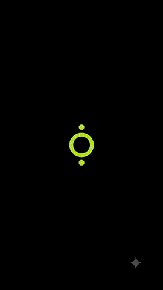
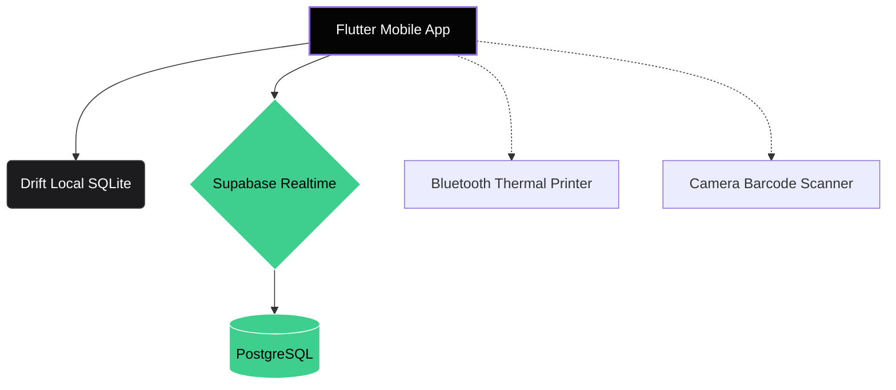

<div align="center">
  
  <h1>Aven POS</h1>
  <p><strong>A restaurant POS that doesn't look like it was built in 2004.</strong></p>

  <p>
    
    
    
    
  </p>
</div>

---

<p align="center">
  <i>We made managing a restaurant less painful. Built with questionable amounts of caffeine, true OLED blacks, and an obsession with speed. Yes, it actually works.</i>
</p>

---

## 🎥 See It In Action

<p align="center">
  
</p>

### 📱 The UI

| Dashboard | Billing | Kitchen (KDS) |
| :---: | :---: | :---: |
|  |  |  |
> *(Replace screenshot placeholders with actual images once uploaded to `assets/screenshots/`)*

---

## ✨ Why you'll probably love this

* ⚡ **Offline-First:** Because restaurant Wi-Fi is universally terrible. Driven by local `Drift` SQLite caching.
* 🌙 **True OLED Dark Mode:** Pitch-black `#040404` backgrounds and neon accents. Saves battery, saves your eyes, looks insanely premium.
* 📱 **QR Onboarding:** Staff can join your business by literally just scanning a QR code. No setup hell.
* 🖨️ **Bluetooth Thermal Printing:** It actually prints physical receipts to generic Bluetooth printers. Yes, it was painful to build. You're welcome.
* 🔥 **Real-time Sync:** Kitchen gets orders instantly. Waiters see status updates instantly. No more screaming across the room.

---

## 🛠️ Tech Stack

### 📱 Mobile Front-End
* **Framework:** [Flutter](https://flutter.dev/) (Dart)
* **State Management:** Riverpod
* **Routing:** GoRouter
* **Local DB:** Drift (SQLite)

### ☁️ Backend & Cloud
* **BaaS:** [Supabase](https://supabase.com/)
* **Database:** PostgreSQL
* **Auth:** Supabase Auth (Multi-tenant business architecture)

### 🔌 Hardware Integrations
* **Printing:** `print_bluetooth_thermal`
* **Scanning:** `mobile_scanner` (Google MLKit)

---

## 🏗️ Architecture



---

## 🚀 Getting Started

Getting this running locally is ridiculously easy.

### Requirements
* Flutter SDK (`>=3.13.2`)
* Dart SDK
* Supabase project (Free tier is perfectly fine)

### 1. Clone the repo
```bash
git clone https://github.com/Naikhet18/Aven.git
cd Aven
```

### 2. Install dependencies
```bash
flutter pub get
```

### 3. Environment Variables
Create a `.env` file in the root directory. Do **not** commit this file.

```env
SUPABASE_URL=your_project_url
SUPABASE_ANON_KEY=your_anon_key
```

### 4. Run the app
```bash
# To run on a connected Android/iOS device
flutter run --dart-define-from-file=.env

# To build the production universal APK
flutter build apk --release --dart-define-from-file=.env
```

---

## 📲 Get the App

<a href="#">
  
</a>

<a href="#">
  
</a>

---

## 🗺️ Roadmap

Things currently living rent-free in my backlog:

- [x] Initial release
- [x] God-level OLED UI
- [x] Supabase Auth & Realtime
- [x] Bluetooth Thermal Printing
- [x] QR Staff Onboarding
- [ ] Automated Inventory deduction
- [ ] AI sales forecasting (because why not)
- [ ] Push to Play Store / App Store

---

## 🤝 Contributing

Found a bug? Congrats, you're now part of the development team. 🫡

1. Fork the Project
2. Create your Feature Branch (`git checkout -b feature/AmazingFeature`)
3. Commit your Changes (`git commit -m 'Add some AmazingFeature'`)
4. Push to the Branch (`git push origin feature/AmazingFeature`)
5. Open a Pull Request

---

## 🔐 Privacy & Security

* **Authentication:** Handled entirely by Supabase Auth.
* **Multi-Tenancy:** Row Level Security (RLS) policies strictly enforce that users can only read/write data for the `business_id` they belong to.
* **Local Data:** Offline cached data is stored securely in SQLite via Drift.

---

## 📄 License

Distributed under the MIT License. See `LICENSE` for more information.

---

## 🧑‍💻 Author

Built with questionable amounts of caffeine by **Naikhet18**.

* GitHub: [@Naikhet18](https://github.com/Naikhet18)

---

## 💬 Support

If this app somehow breaks your thermal printer, open an Issue.
For general chats or feature requests, hit up the Discussions tab.

---

> ⭐ If this project saved you from writing 10,000 lines of boilerplate POS code, drop a star.
> 
> It feeds the developer's ego.

<br>

<p align="center">
  Made with ❤️, caffeine ☕, and an unreasonable number of tabs.
</p>
