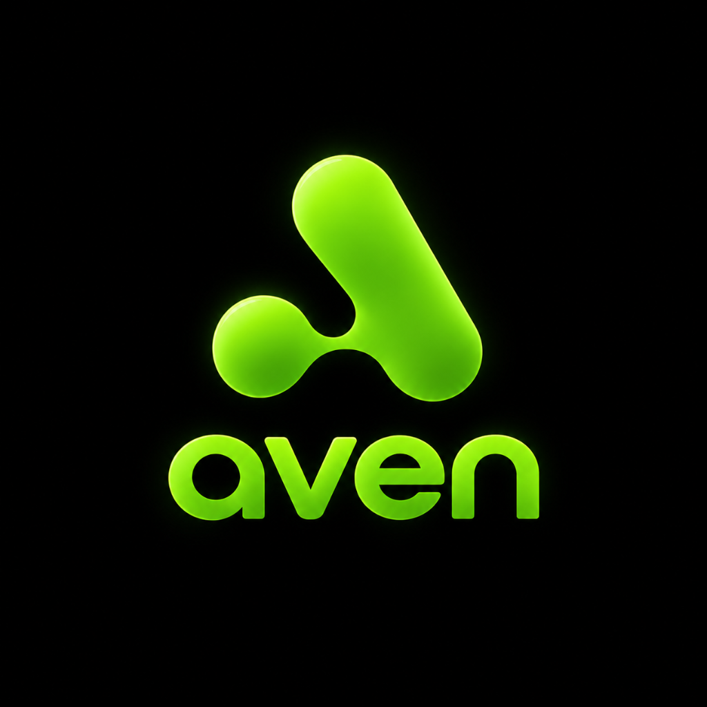

<div align="center">
  
  <h1>Aven POS</h1>
  <p><strong>A restaurant POS that doesn't look like it was built in 2004.</strong></p>

  <p>
    
    
    
    
  </p>
</div>

---

<p align="center">
  <i>We made managing a restaurant less painful. Built with questionable amounts of caffeine, true OLED blacks, and an obsession with speed. Yes, it actually works.</i>
</p>

---

# 💸 Current Cost

> **$0**

For this private testing phase:
* **GitHub** → free
* **GitHub Releases** → free
* **Android APK distribution** → free
* **SideStore** → open source
* **iOS sideloading** → free Apple Account approach

Future official distribution can move to Apple App Store + Google Play when the project is ready.

---

# 📲 Download

<p align="center">

### 🤖 Android

<a href="https://github.com/Naikhet18/Aven/releases/latest/download/Aven-android.apk">
  
</a>

**Latest release:** `v1.0.0`

> Download the APK → install → you're in. 🚀

⚠️ **Android Installation Note:** Because you are downloading this directly from GitHub instead of the Play Store, Android will show a standard prompt warning about "installing from unknown sources." You can safely click "Settings" on that prompt and toggle the switch to allow installation.

### 🍎 iOS

<a href="https://github.com/Naikhet18/Aven/releases/latest/download/Aven-ios.ipa">
  
</a>

> See the installation guide below for how to install this on your iPhone for free without an Apple Developer account.

</p>

---

## 🍎 iPhone Installation — Free

Made this POS specifically for my people. Apple said "pay up" — we're currently choosing another route. 💀

Because this app isn't on the App Store yet, iPhone users can use **SideStore** to install the IPA directly.

### Step 1 — Install SideStore
SideStore lets you sideload apps using your free Apple Account.
* **Official Website:** [https://sidestore.io/](https://sidestore.io/)
* **Official Installation Guide:** [https://docs.sidestore.io/docs/installation/install](https://docs.sidestore.io/docs/installation/install)

### Step 2 — Check Requirements
To install SideStore initially, you need:
* iPhone/iPad running iOS/iPadOS 15.0+
* A free Apple Account
* A computer (macOS, Windows, Linux, or supported Chromebook) for the **initial** installation.
* Wi-Fi connection
* *Check the [Official Prerequisites](https://docs.sidestore.io/docs/installation/prerequisites) for current details.*

### Step 3 — The Installation Flow
1. Connect your iPhone to your computer via USB.
2. Follow the official guide to install SideStore onto your phone.
3. Trust your developer profile in your iPhone Settings.
4. Open SideStore on your phone and sign in with your Apple Account.

### Step 4 — Install My Restaurant POS
Once SideStore is working on your phone:
1. Download the latest `Aven-ios.ipa` from the Download button above.
2. Open/Share the `.ipa` file with the SideStore app.
3. Choose **Install**.
4. Launch the restaurant POS and start taking orders!

### 🔄 Updating the POS
When a new version is released:
Download the latest IPA → Open in SideStore → Update.

---

> [!WARNING]
> ### ⚠️ Before you install (SideStore Limitations)
> This is an unofficial/private sideloading distribution method.
> SideStore relies on Apple's free development signing system and periodically refreshes apps to prevent the normal short signing period (7 days) from expiring.
> You may need to keep SideStore and its required VPN functionality configured correctly for background refreshing to work.
> Apple can change its policies or technical behavior at any time. SideStore periodically refreshes apps so they can continue working beyond the normal free signing period, subject to Apple's limitations and SideStore's current functionality.

> [!CAUTION]
> ### 🔐 Security
> **Never** enter your Apple Account password into this project's website, GitHub repository, or random third-party services. When setting up SideStore, only follow the [official SideStore documentation](https://docs.sidestore.io/) and enter credentials directly into their official app.

---

## 🍽️ Built For The Restaurant

This isn't another generic demo app. It's a POS I built specifically for a few restaurants I know. We stripped away the bloat and added what actually matters:

* 🧾 **Billing:** Split bills, custom totals, easy checkout.
* 🍔 **Menu Management:** Control inventory and stock.
* 🪑 **Table Management:** Track dine-in states effortlessly.
* 📦 **Orders:** Unified order processing.
* 👨‍🍳 **Kitchen Workflow (KDS):** Real-time Kitchen Display System sync. Stop screaming across the room.
* 👥 **Staff:** Onboard servers instantly via QR Code.
* 🔐 **Authentication:** Secure Multi-tenant business logic.
* 🖨️ **Thermal Printing:** Direct Bluetooth receipt printing.

---


## 🛠️ Tech Stack

* **Framework:** [Flutter](https://flutter.dev/) (Dart)
* **State Management:** Riverpod
* **Routing:** GoRouter
* **Local DB:** Drift (SQLite)
* **BaaS & DB:** [Supabase](https://supabase.com/) & PostgreSQL
* **Hardware Integrations:** `print_bluetooth_thermal` & `mobile_scanner`

---

## 🚀 Getting Started

Getting this running locally for development is ridiculously easy.

### Requirements
* Flutter SDK (`>=3.13.2`)
* Dart SDK
* Supabase project

### 1. Clone the repo
```bash
git clone https://github.com/Naikhet18/Aven.git
cd Aven
```

### 2. Install dependencies
```bash
flutter pub get
```

### 3. Environment Variables
Create a `.env` file in the root directory. Do **not** commit this file.

```env
SUPABASE_URL=your_project_url
SUPABASE_ANON_KEY=your_anon_key
```

### 4. Run the app
```bash
flutter run --dart-define-from-file=.env
```

---

## 🚀 First Release Checklist

### 🤖 Android
- [x] Build release APK
- [x] Test APK
- [x] Create GitHub Release
- [x] Upload APK
- [ ] Test direct APK link
- [ ] Test README download button

### 🍎 iOS
- [x] Build release IPA (Unsigned Payload for SideStore)
- [ ] Test IPA with SideStore
- [x] Create GitHub Release
- [x] Upload IPA
- [ ] Test direct IPA download
- [ ] Test installation on a real iPhone
- [ ] Confirm SideStore refresh works
- [ ] Test POS with real restaurant workflow

### 🔐 Security
- [x] No API keys committed
- [x] No Supabase service-role key exposed
- [x] No Apple credentials committed
- [x] No signing certificates/private keys committed
- [x] `.env` files ignored
- [x] Production configuration verified

---

## 🤝 Contributing

Found a bug? Congrats, you're now part of the development team. 🫡

1. Fork the Project
2. Create your Feature Branch (`git checkout -b feature/AmazingFeature`)
3. Commit your Changes (`git commit -m 'Add some AmazingFeature'`)
4. Push to the Branch (`git push origin feature/AmazingFeature`)
5. Open a Pull Request

---

## 📄 License

Distributed under the MIT License. See `LICENSE` for more information.

---

> ⭐ If this project saved you from writing 10,000 lines of boilerplate POS code, drop a star.
> 
> It feeds the developer's ego.

<br>

<p align="center">
  Made with ❤️, caffeine ☕, and an unreasonable number of tabs.
</p>
