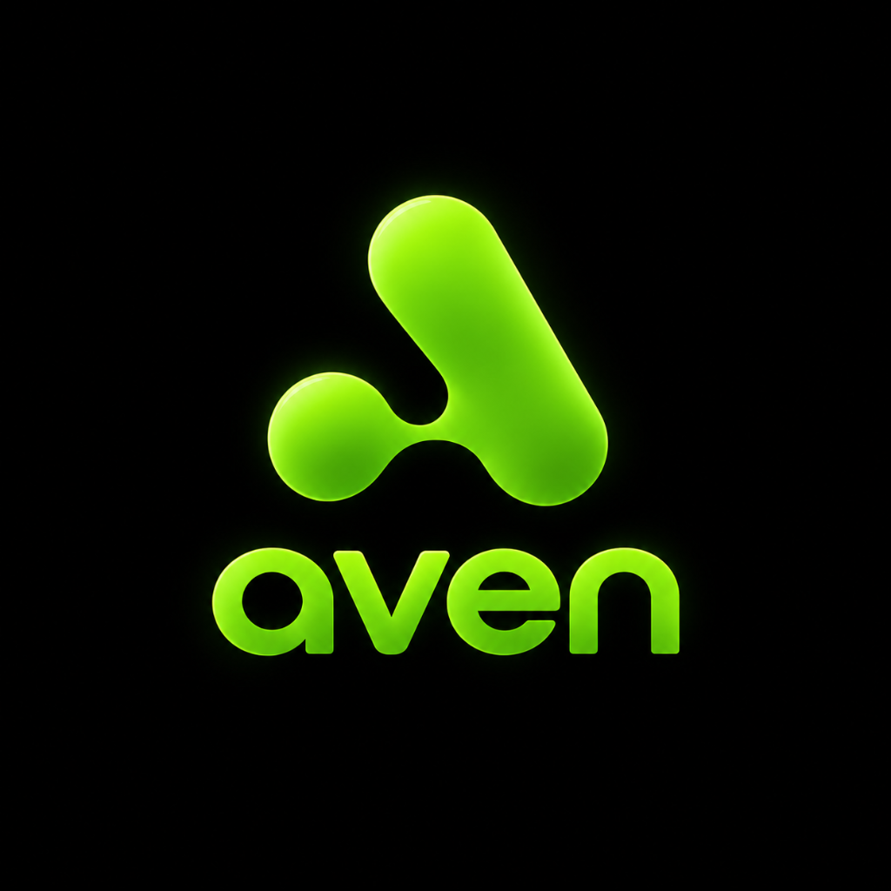

<div align="center">
  
  <h1>Aven POS</h1>
  <p><strong>A restaurant POS that doesn't look like it was built in 2004.</strong></p>

  <p>
    <a href="https://github.com/Naikhet18/Aven/releases">
      
    </a>
    
    
    
  </p>

  <p>
    <i>We made managing a restaurant less painful. Built with questionable amounts of caffeine, true OLED blacks, and an obsession with speed. Yes, it actually works.</i>
  </p>
</div>

---

## 📖 Table of Contents
- [✨ Core Features](#-core-features)
- [📲 Download & Installation](#-download--installation)
  - [Android Setup](#-android)
  - [iOS Setup (Free Sideloading)](#-ios)
- [🛠️ Tech Stack](#-tech-stack)
- [💻 Developer Setup](#-developer-setup)
- [🗺️ Release Roadmap](#️-release-roadmap)
- [🤝 Contributing](#-contributing)

---

## ✨ Core Features

This isn't another bloated, generic demo app. It's a hyper-focused POS built for real restaurant workflows. We stripped away the noise and perfected what actually matters:

| Category | Features |
| :--- | :--- |
| **🧾 Checkout & Billing** | Split bills, custom totals, tax handling, and lightning-fast checkout flows. |
| **🍔 Menu & Inventory** | Real-time stock control, variant management, and out-of-stock toggles. |
| **🪑 Floor Management** | Visual table layouts, real-time dine-in states, and occupancy tracking. |
| **👨‍🍳 Kitchen (KDS)** | Real-time Kitchen Display System sync. Stop screaming orders across the room. |
| **👥 Staff & Security** | Secure multi-tenant business logic. Onboard servers instantly via QR Codes. |
| **🖨️ Hardware** | Direct Bluetooth integration for thermal receipt printing and mobile scanning. |

---

## 💸 Cost Breakdown

> **Current Cost: $0**

During this private testing phase, the entire infrastructure is free:
* **Hosting/DB** → Supabase Free Tier
* **Distribution** → GitHub Releases
* **Android APK** → Free to distribute
* **iOS Sideloading** → Free via SideStore (Apple Account approach)

*(Future official distributions will transition to the App Store + Google Play.)*

---

## 📲 Download & Installation

### 🤖 Android
[](https://github.com/Naikhet18/Aven/releases/latest/download/Aven-android.apk)

**Latest release:** `v1.0.0`
1. Download the APK directly from the badge above.
2. Open the file on your device.
3. *Note: Android will show a standard "installing from unknown sources" warning. Click "Settings" and toggle the switch to allow the installation.*

<br>

### 🍎 iOS
[](https://github.com/Naikhet18/Aven/releases/latest/download/Aven-ios.ipa)

Because this app isn't on the App Store yet (Apple said "pay up", we said "no thanks"), iPhone users can use **SideStore** to install the IPA directly for free.

<details>
<summary><b>📖 Click to expand: Step-by-Step iPhone Installation Guide</b></summary>

#### Step 1 — Install SideStore
SideStore lets you sideload apps using your free Apple Account.
* **Official Website:** [sidestore.io](https://sidestore.io/)
* **Installation Guide:** [SideStore Docs](https://docs.sidestore.io/docs/installation/install)

#### Step 2 — Check Requirements
* iPhone/iPad running iOS/iPadOS 15.0+
* A free Apple Account
* A computer (Mac, Windows, Linux) for the **initial** installation only.
* Wi-Fi connection

#### Step 3 — The Installation Flow
1. Connect your iPhone to your computer via USB.
2. Follow the official guide to install SideStore onto your phone.
3. Trust your developer profile in `Settings > General > VPN & Device Management`.
4. Open SideStore on your phone and sign in with your Apple Account.

#### Step 4 — Install Aven POS
Once SideStore is working on your phone:
1. Download the latest `Aven-ios.ipa` from the black badge above.
2. Open/Share the `.ipa` file with the SideStore app.
3. Choose **Install**.
4. Launch Aven and start taking orders!

#### 🔄 Updating the POS
When a new version is released: Download the latest IPA → Open in SideStore → Update.

> **⚠️ SideStore Limitations & Security**
> This is an unofficial sideloading method. SideStore relies on Apple's free dev signing system and uses a local VPN to automatically refresh apps every 7 days. Ensure you follow only the [official SideStore documentation](https://docs.sidestore.io/) and **never** enter your Apple ID credentials into random third-party sites.
</details>

---

## 🛠️ Tech Stack

Built for performance, scalability, and developer sanity.

* **Frontend:** [Flutter](https://flutter.dev/) (Dart)
* **Backend & Auth:** [Supabase](https://supabase.com/) (PostgreSQL)
* **State Management:** Riverpod
* **Routing:** GoRouter
* **Local Database:** Drift (SQLite)
* **Hardware Integrations:** `print_bluetooth_thermal` & `mobile_scanner`

---

## 💻 Developer Setup

Getting this running locally is ridiculously easy.

### Prerequisites
* Flutter SDK (`>=3.13.2`) & Dart SDK
* An active Supabase project

### 1. Clone & Install
```bash
git clone [https://github.com/Naikhet18/Aven.git](https://github.com/Naikhet18/Aven.git)
cd Aven
flutter pub get
